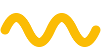

# Bộ nhận diện: GDG on Campus HSU × Runway Club

## Màu

Kit có **hai bộ màu đi cùng nhau**: 4 màu Google cho GDG on Campus HSU, và gradient xanh cho Runway Club. Trang của bạn dùng cả hai.

Logo Runway là một dải gradient xanh, chạy từ xanh tím ở trên xuống xanh da trời ở dưới. Các mã dưới đây lấy trực tiếp từ file logo gốc.

| Vai trò | Mã màu | Dùng ở đâu |
|---|---|---|
| Xanh Runway đậm | `#426EF0` | Tiêu đề, nút chính, điểm nhấn |
| Xanh Runway sáng | `#3FB4FE` | Điểm cuối gradient, hover, highlight |
| Xanh Hoa Sen | `#0C4DA2` | Khi đặt cạnh logo Khoa Công nghệ |
| Đỏ Hoa Sen | `#E8112D` | Chỉ dùng rất ít, làm điểm nhấn |
| Chữ | `#1A1A1A` | Chữ nội dung trên nền sáng |
| Nền sáng | `#FFFFFF` | Nền mặc định |
| Nền tối | `#0F1115` | Dark mode |

Màu Google, dùng cho phần GDG on Campus HSU và các điểm nhấn chung:

| Màu | Mã |
|---|---|
| Blue | `#4285F4` |
| Red | `#EA4335` |
| Yellow | `#FBBC04` |
| Green | `#34A853` |

Dán vào CSS:

```css
:root {
  --runway-deep:  #426ef0;
  --runway-light: #3fb4fe;
  --runway-gradient: linear-gradient(160deg, #426ef0 0%, #3fb4fe 100%);

  --hsu-blue: #0c4da2;
  --hsu-red:  #e8112d;

  --google-blue:   #4285f4;
  --google-red:    #ea4335;
  --google-yellow: #fbbc04;
  --google-green:  #34a853;

  --text: #1a1a1a;
  --bg:   #ffffff;
}

@media (prefers-color-scheme: dark) {
  :root { --text: #f2f2f2; --bg: #0f1115; }
}
```

Gradient của logo đi theo hướng chéo từ trên xuống dưới. Khi làm nền hoặc nút bấm, giữ đúng hướng đó cho đồng bộ với logo.

## Font: mỗi CLB một font, dùng chung trên một trang

Trang web giới thiệu **cả hai CLB cùng lúc**, nên giữ font riêng của từng bên:

| Thương hiệu | Font | Dùng ở đâu |
|---|---|---|
| **GDG on Campus HSU** | **Google Sans** | Khi nói về GDG on Campus HSU |
| **Runway Club** | **Maven Pro** | Khi nói về Runway Club, slogan *New Journey – New Challenges* |

Cả hai đều có trên Google Fonts, miễn phí và **đủ dấu tiếng Việt**. Nhúng một lần cho cả hai:

```html
<link rel="preconnect" href="https://fonts.googleapis.com">
<link rel="preconnect" href="https://fonts.gstatic.com" crossorigin>
<link href="https://fonts.googleapis.com/css2?family=Google+Sans:wght@400;500;700&family=Maven+Pro:wght@400;500;600;700&display=swap" rel="stylesheet">
```

```css
:root {
  --font-gdg:    "Google Sans", system-ui, sans-serif;
  --font-runway: "Maven Pro", system-ui, sans-serif;
}
```

Luôn kiểm tra font hiển thị đúng dấu: **ê ệ ữ ỳ ọ ậ**. Nếu chữ nào nhảy sang font khác là link font bị sai.

## Kết hợp hai CLB trên một trang

Trang của bạn giới thiệu **cả GDG on Campus HSU lẫn Runway Club**. Hãy kết hợp hai bộ nhận diện (logo, màu, font) của hai CLB lại với nhau **sáng tạo nhất có thể**. Kết hợp thế nào là do bạn.

## Logo có sẵn

Tất cả nằm trong `assets/logo/`.

| File | Dùng khi nào |
|---|---|
| `logo-runway-horizontal.png` | Logo chính, có chữ "Runway Club" và slogan. Dùng ở header, hero |
| `logo-runway-icon.png` | Chỉ hình tam giác chữ R. Dùng làm favicon, avatar, icon nhỏ |
| `logo-runway-white.png` | Bản trắng có chữ, đặt trên nền tối hoặc nền ảnh |
| `logo-runway-icon-white.png` | Icon bản trắng |
| `logo-gdg-oncampus-light.png` | Logo GDG on Campus cho nền sáng |
| `logo-gdg-oncampus-white.png` | Logo GDG on Campus cho nền tối |
| `logo-google-developers.png` | Logomark Google Developers |
| `logo-hsu-congnghe-blue-vi.png` | Khoa Công nghệ HSU, tiếng Việt, nền sáng |
| `logo-hsu-congnghe-white-vi.png` | Khoa Công nghệ HSU, tiếng Việt, nền tối |
| `logo-hsu-fit-blue-en.png` | Faculty of Information Technology, tiếng Anh |

## Icon

Icon nằm trong `assets/icons/`, tất cả là SVG một màu dùng `currentColor`, nên **đổi màu bằng CSS `color`**.

| Thư mục | Có gì | Nguồn & giấy phép |
|---|---|---|
| `icons/ui/` | 67 icon giao diện: menu, close, arrow-right, calendar, clock, place, email, groups, school, code, rocket, trophy, discord-style chat... | Material Design Icons (Google), Apache 2.0 |
| `icons/social/` | facebook, messenger, instagram, discord, github, youtube, tiktok, zalo, gmail | Simple Icons, CC0 |
| `icons/tech/` | flutter, dart, firebase, android, kotlin, go, kubernetes, angular, google-cloud, gemini, tensorflow, chrome, html5, css, javascript, typescript, python, git, figma, vercel, netlify | Simple Icons, CC0 |

Cách 1, chèn thẳng SVG để đổi màu theo chữ (mở file .svg, copy nội dung dán vào HTML):

```html
<a class="social" href="https://discord.gg/...">
  <svg viewBox="0 0 24 24" fill="currentColor">...</svg> Discord
</a>
```
```css
.social { color: var(--runway-deep); }
.social svg { width: 24px; height: 24px; }
```

Cách 2, dùng như ảnh (giữ màu đen mặc định, nhanh nhất):

```html

```

Cách 3, dùng làm mask để tô màu bất kỳ mà không cần chèn SVG:

```css
.icon { width: 24px; height: 24px; background: var(--google-blue);
        -webkit-mask: url(assets/icons/ui/place.svg) center/contain no-repeat;
                mask: url(assets/icons/ui/place.svg) center/contain no-repeat; }
```

Icon trong kit là icon trung tính, dùng được cho trang của cả GDG on Campus HSU lẫn Runway Club.

Logo công nghệ **bản màu gốc** (để làm mục "Công nghệ chúng mình dùng") nằm ở `assets/tech-logos/`. Logo thương hiệu thuộc về chủ sở hữu, chỉ dùng để nhắc tới công nghệ đó, không sửa màu hay hình.

## Hình trang trí

`assets/decor/` có các hình theo phong cách Google: `circle`, `ring`, `half-circle`, `quarter`, `star`, `plus`, `dots`, `squiggle`, `zigzag`, `brackets` ở cả 4 màu (`-blue`, `-red`, `-yellow`, `-green`) và `google-bar.svg` (thanh 4 màu). Dùng làm điểm nhấn ở góc section, sau ảnh, cạnh tiêu đề. Đừng rải quá nhiều, 2–3 hình mỗi màn hình là vừa.

```html

```
```css
.hero { position: relative; }
.deco { position: absolute; top: 24px; right: 5%; width: 120px; pointer-events: none; }
```

## Favicon và ảnh chia sẻ link

```html
<!-- chọn MỘT bộ: gdg/ (GDG on Campus HSU) hoặc runway/ (Runway Club) -->
<link rel="icon" href="assets/favicon/gdg/favicon.ico" sizes="any">
<link rel="apple-touch-icon" href="assets/favicon/gdg/apple-touch-icon.png">
<meta property="og:title" content="GDG on Campus HSU × Runway Club">
<meta property="og:description" content="One community for IT students at Hoa Sen University.">
<meta property="og:image" content="assets/images/og-cover.jpg">
```

Khi deploy, đổi đường dẫn `og:image` thành link đầy đủ (bắt đầu bằng `https://`) thì Facebook, Zalo, Discord mới hiện ảnh.

## Linh vật, app và P2Game

| Thư mục | Có gì |
|---|---|
| `mascots/` | `go-gopher.png`, `dash-flat.png` (Flutter), `sparky-flat.png` (Firebase), bản 2D nền trong suốt |
| `partners/apps/` | Icon 13 sản phẩm: Scripture, Ahoc, Alife, Hatomic, Arity, Mikademy Pass, Herbal Index, Greeny, Moments, IT Support, Live Fasting, Landlords, Nohost Cloud |
| `partners/mikademy-logo.png` | Logo Mikademy (đối tác) |
| `partners/p2game/` | Logo P2Game (icon, chữ màu, chữ trắng) |
| `badges/info-session-badge.png` | Huy hiệu Info Session |

## Quy tắc dùng logo

**Được:**
- Giữ nguyên tỉ lệ khi phóng to thu nhỏ
- Chừa khoảng trống quanh logo tối thiểu bằng chiều cao chữ "R" trong logo
- Dùng bản trắng khi nền tối hoặc nền ảnh
- Logo icon tối thiểu 32px, logo ngang tối thiểu 120px chiều rộng

**Không được:**
- Đổi màu logo, kể cả đổi gradient sang màu khác
- Kéo giãn làm méo
- Thêm viền, đổ bóng, xoay nghiêng
- Đặt logo màu lên nền xanh cùng tông làm chìm mất
- Ghép logo Runway dính sát logo GDG hay HSU thành một khối

## Giọng văn

Thân thiện, gần gũi với sinh viên, không sáo rỗng. Xưng "chúng mình" hoặc "CLB", gọi người đọc là "bạn". Slogan của Runway Club: **New Journey – New Challenges** (viết bằng Maven Pro). Khi nhắc chung hai CLB, gọi là **GDG on Campus HSU × Runway Club**; khi nhắc riêng GDG thì viết đúng tên **GDG on Campus HSU**, không viết GDSC nữa.
